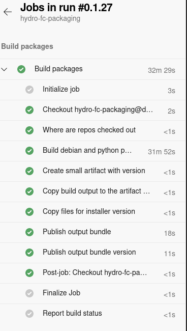

# Build pipelines for hydrologic simulation and forecasting tools - Linux

## Purpose

Our [streamflow forecasting software stack](https://github.com/csiro-hydroinformatics/streamflow-forecasting-tools-onboard/) is quite mature and complicated. To facilitate building and packaging we need contemporary build pipeline to **minimise manual steps**.

This repository contains material to streamline the build, testing and possible deployment of hydrologic simulation and forecasting tools.

* Functional scope: swift and fogss, and dependencies, mostly in practice uchronia
* Management of versions of software built across many code repositories

### Output artifacts

Available or potentially, we have:

* Debian packages (Beta)
* RPM packages (?)
* zip archives of prebuilt packages for windows.
* R packages (Mature)
* python packages (Beta)
* matlab functions (?)
* conda packages (Alpha - Feasibility study)
* offline and online documentation (Partial)

This build pipeline, and the ones related listed below in Related Work, are a foundation to deliver swift via the following paths

* Docker image with Jupyter-lab and the full stack available
* Pre-built binaries for windows, self contained C runtime (ms vc 2019), prebuilt R packages for windows
* Docker image for running on EASI
* Deployment on clusters
* Other

## Status

Currently, it builds packages for deployment on Debian-flavored linux, with user-oriented packages for Python and R. One motivation to invest into Debian packaging was to distribute our software for Linux without needing to give access to source code. These have been re-used in projects undertaken for Digital Water and Landscape (model benchmarking).

As of 2022-03 this contains one pipeline:

* Under the subdirectory packages is a pipeline building debian packages of SWIFT2 and its dependencies.
  * The pipeline uses secret pipeline variable to pass a personal access token to check out git repositories over ssh. This is a better alternative than copying ssh keys into docker containters and trying to conceal them.

Other pipelines on the roadmap or wishlist:

* building a docker image for simulation and forecasting with SWIFT2 via a Jupyter front end. This relates notably to runing on EASI with a custom image, because for instance some of the packages (ipywidgets, bqplot) are not and should not be in the default easi image (bloat).

## Related work

* [easi-hydro-forecast](https://bitbucket.csiro.au/projects/SF/repos/easi-hydro-forecast/browse)
* [hydro-fc-windows-os](https://bitbucket.csiro.au/projects/SF/repos/hydro-fc-windows-os/browse), which may be merged with this pipeline at some point.

## TODO

* Define a set of docker images with/for swift, starting with an image with debian packages ready to build from source
  * Where to store? csiro docker registry but not sure if/how to access from cloud pipeline.

## Contact

jean-michel.perraud@csiro.au
david.robertson@csiro.au
