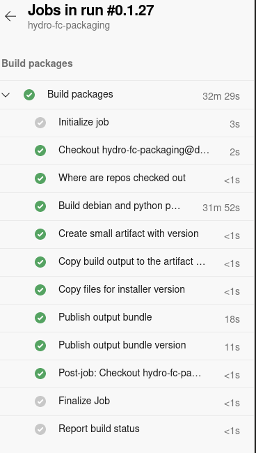

# Build pipelines for hydrologic simulation and forecasting tools - Linux



## Purpose

Our [streamflow forecasting software stack](https://github.com/csiro-hydroinformatics/streamflow-forecasting-tools-onboard/) is quite mature and complicated. To facilitate building and packaging we need contemporary build pipeline to **minimise manual steps**.

This repository contains material to streamline the build, testing and possible deployment of hydrologic simulation and forecasting tools.

* Functional scope: swift and fogss, and dependencies, mostly in practice uchronia
* Management of versions of software built across many code repositories

### Output artifacts

Available or potentially, we have:

* Debian packages (Beta)
* RPM packages (?)
* zip archives of prebuilt packages for windows.
* R packages (Mature)
* python packages (Beta)
* matlab functions (?)
* conda packages (Alpha - Feasibility study)
* offline and online documentation (Partial)

This build pipeline, and the ones related listed below in Related Work, are a foundation to deliver swift via the following paths

* Docker image with Jupyter-lab and the full stack available
* Pre-built binaries for windows, self contained C runtime (ms vc 2019), prebuilt R packages for windows
* Docker image for running on EASI
* Deployment on clusters
* Other

## Status

Currently, it builds packages for deployment on Debian-flavored linux, with user-oriented packages for Python and R. One motivation to invest into Debian packaging was to distribute our software for Linux without needing to give access to source code. These have been re-used in projects undertaken for Digital Water and Landscape (model benchmarking).

As of 2022-03 this contains one pipeline:

* Under the subdirectory packages is a pipeline building debian packages of SWIFT2 and its dependencies.
  * The pipeline uses a GitHub App installation token to check out private git repositories. This scopes authentication to only the specific repositories that the App is installed on, unlike a classic PAT which grants read access to all repositories accessible to the token owner.

Other pipelines on the roadmap or wishlist:

* building a docker image for simulation and forecasting with SWIFT2 via a Jupyter front end. This relates notably to runing on EASI with a custom image, because for instance some of the packages (ipywidgets, bqplot) are not and should not be in the default easi image (bloat).

## Related work

* [easi-hydro-forecast](https://bitbucket.csiro.au/projects/SF/repos/easi-hydro-forecast/browse)
* [hydro-fc-windows-os](https://bitbucket.csiro.au/projects/SF/repos/hydro-fc-windows-os/browse), which may be merged with this pipeline at some point.

## GitHub App setup

The workflow authenticates to private repositories using a **GitHub App** installation token rather than a classic Personal Access Token (PAT). A GitHub App can be installed on specific repositories only, so the token it generates has read access to exactly those repositories and nothing else.

### Why not a classic PAT?

A classic PAT inherits access to every repository the generating user can access — there is no way to restrict it to a subset. A **fine-grained PAT** does support per-repository scoping, but tokens are tied to a personal account and expire. A **GitHub App** is the preferred solution for CI/CD because:

* Access is scoped to the exact set of repositories the App is installed on.
* Installation tokens are short-lived (expire after 1 hour).
* The App identity is separate from any individual user account.

### Creating and configuring the GitHub App

1. Go to **GitHub → Settings → Developer settings → GitHub Apps → New GitHub App**.
2. Give the App a name (e.g. `hydro-forecast-builder`).
3. Under **Repository permissions**, set **Contents** to **Read-only**. No other permissions are needed.
4. Uncheck **Webhook active** — this App only needs to generate tokens.
5. Save and note the **App ID**.
6. Generate a **private key** for the App (download the `.pem` file).
7. Install the App on the `csiro-internal` organization and select **Only select repositories**. Add every repository that `checkouts.sh` clones:
   * `csiro-internal/sf-stack`
   * `csiro-internal/cruise-control`
   * `csiro-internal/config-utils`
   * All repositories listed in `sf-stack/reponames.sh` (`reponames_bb_checkout` and `reponames_gh` arrays). Check this file in the `sf-stack` repository for the authoritative list — you may need to do an initial broad install, clone `sf-stack`, inspect `reponames.sh`, and then narrow the App's installation to exactly those repositories.

### Adding secrets to this repository

Add the following secrets in **Settings → Secrets and variables → Actions**:

| Secret name                    | Value                                         |
| ------------------------------ | --------------------------------------------- |
| `CSIRO_INTERNAL_APP_ID`        | The numeric App ID shown on the App settings page |
| `CSIRO_INTERNAL_APP_PRIVATE_KEY` | The full contents of the downloaded `.pem` private-key file |

## TODO

* Define a set of docker images with/for swift, starting with an image with debian packages ready to build from source
  * Where to store? csiro docker registry but not sure if/how to access from cloud pipeline.

## Contact

jean-michel.perraud@csiro.au
david.robertson@csiro.au

## Appendices

### Testing the pipeline

```sh
docker stop $(docker ps -a -q)
docker rm $(docker ps -a -q)
# CAUTION with below
docker rmi --force $(docker images -q)
```

```sh
cd ${HOME}/src/hydro-fc-packaging/packages
root_out_dir=${HOME}/tmp/nix_pipeline
mkdir -p ${root_out_dir}

. ${HOME}/credentials/secrets/az_pat 
export BRANCH_NAME_ENV_VAR=main

./build-packages.sh ${root_out_dir}
ls ${root_out_dir}
```
